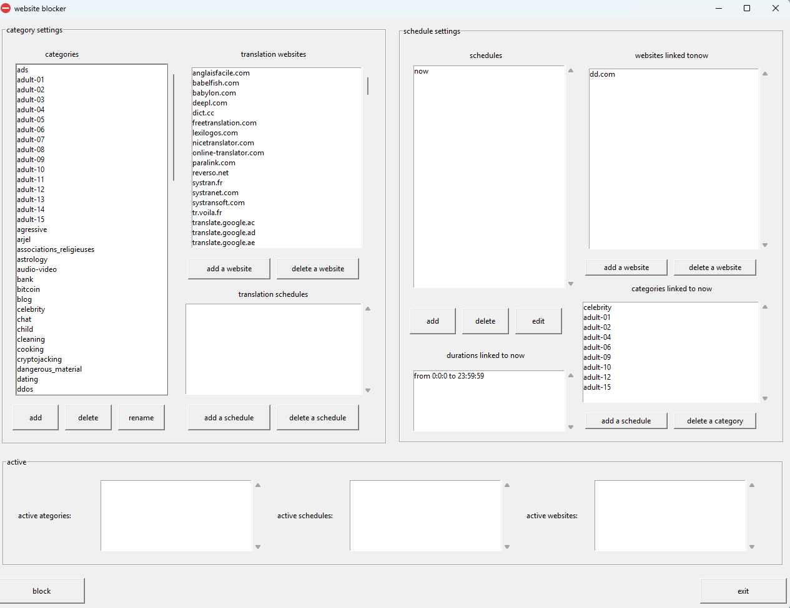

# 🛑 Website Blocker — Desktop Productivity Tool

> ⚡ Python desktop application for blocking websites via the system hosts file, with scheduling, category management, and real-time activation.

---

## 📌 Overview

Website Blocker is a desktop application designed to help users control access to distracting websites by modifying the system hosts file.

The application allows users to define categories of websites, assign schedules, and automatically enable or disable blocking based on time intervals.

This project focuses on system-level interaction, automation, and building a complete desktop tool with a graphical interface.

---

## 📍 Project Context

This project was developed in 2021 as part of a freelance experience involving the design and implementation of a custom desktop utility.

The goal was to build a flexible system for managing website blocking with scheduling capabilities and a user-friendly interface.

---

## ✨ Features

### 🗂️ Category-Based Blocking
- Group websites into custom categories  
- Manage large sets of domains efficiently  
- Load and organize websites dynamically  

### ⏱️ Schedule Management
- Define time intervals for blocking  
- Associate schedules with categories or individual websites  
- Automatic activation based on current time  

### 🌐 Website-Level Control
- Add/remove individual websites  
- Link websites directly to schedules  
- Fine-grained control over blocking behavior  

### ⚙️ System-Level Blocking
- Modify the Windows `hosts` file to block domains  
- Redirect blocked websites to local addresses  
- Restore original configuration when disabled  

### 🧵 Real-Time Execution
- Background listener checks active schedules continuously  
- Updates blocking rules dynamically  
- Uses multithreading to keep the UI responsive  

### 🖥️ Desktop GUI
- Built with Tkinter  
- Interactive interface for managing categories, schedules, and websites  
- Real-time display of active blocking state  

---

## 🧠 Engineering Highlights

This project demonstrates:

- Interaction with system-level configuration (hosts file)  
- Design of a modular structure (categories, schedules, websites)  
- Use of multithreading for background tasks and UI responsiveness  
- File-based persistence using JSON and structured directories  
- Implementation of time-based logic and scheduling systems  
- Building a complete desktop application with a graphical interface  

---

## 🛠️ Tech Stack

- **Language:** Python  
- **GUI:** Tkinter  
- **Concurrency:** threading  
- **Storage:** File system + JSON  
- **System Interaction:** Windows hosts file  

---


## 🏠 Main Interface



---

## 🚀 How It Works

1. Users define **categories** of websites  
2. Create **schedules** with time intervals  
3. Link categories or websites to schedules  
4. The application continuously checks active schedules  
5. When active:
   - Websites are written to the system hosts file  
   - Access is blocked automatically  
6. When inactive:
   - Original configuration is restored  

---

## ⚠️ Notes

- This application modifies the system `hosts` file and may require administrator privileges  
- Designed for Windows environments  
- Intended for educational and productivity use  
- Some parts of the architecture could be further improved in newer iterations  

---

## 📦 Local Installation

```bash
git clone https://github.com/abelkadii/website-blocker.git
cd website-blocker
python main.py
